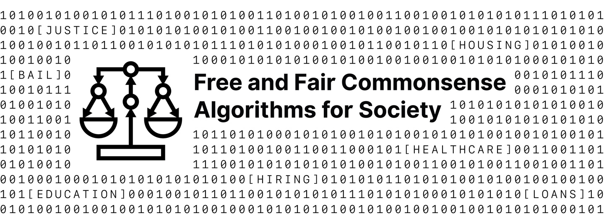

# Contributing

Free and Fair Commonsense Algorithms for Society (FAFCSAFS) is a community project. We invite your participation through the development of new algorithms to be featured on the [website](https://free-and-fair-common-sense-algorithms-for-society.org/) for anyone to use, or pull requests improving the development process and architecture, or website, or by submitting issues.

More information about contributing coming soon.
